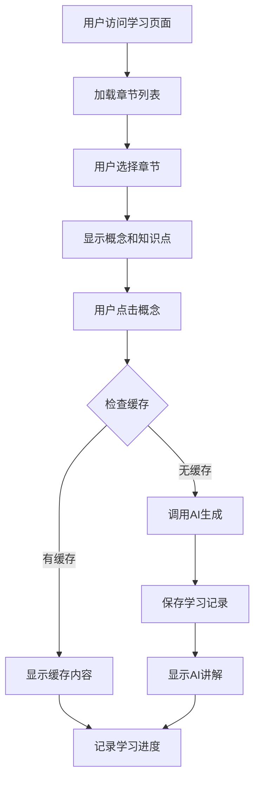
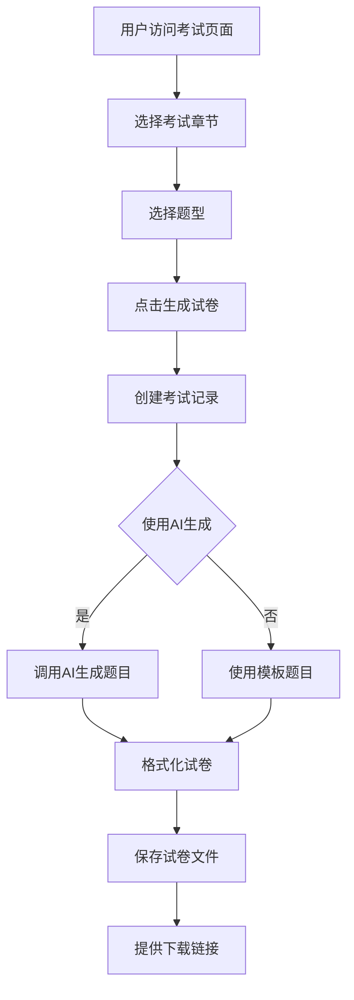
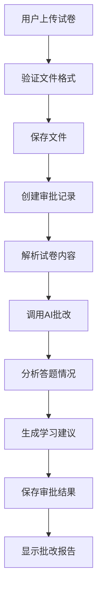

# 数据库学习系统 - 完整系统设计方案

## 1. 系统概述

### 1.1 项目简介
数据库学习系统是一个基于Flask和Ollama AI的现代化Web学习平台，专为辅助学生学习数据库课程设计。系统采用响应式设计，支持跨平台访问，集成了知识学习、考试生成和试卷审批三大核心功能，通过本地AI模型提供智能辅导。

### 1.2 设计目标
- **智能化学习**: 通过AI生成详细讲解，提供个性化学习体验
- **自动化考试**: 根据章节内容自动生成高质量考试试卷
- **智能化审批**: AI批改试卷并提供详细学习建议
- **现代化界面**: 响应式设计，支持多设备访问
- **可扩展性**: 模块化架构，支持多课程管理

### 1.3 核心特性
- 🎓 **智能学习**: 按章节浏览知识点，AI生成详细讲解
- 📝 **智能考试**: 多题型试卷生成，支持AI题目生成
- ✅ **智能审批**: 试卷上传批改，生成学习建议
- ⚙️ **灵活配置**: 动态AI模型配置，多课程管理
- 📱 **响应式设计**: 支持PC、平板、手机等多设备

## 2. 技术架构

### 2.1 技术栈
```
前端技术栈:
├── HTML5 + CSS3 + JavaScript
├── Bootstrap 5 (响应式框架)
├── jQuery (交互处理)
├── Font Awesome (图标库)
└── Mermaid (图表渲染)

后端技术栈:
├── Python 3.8+
├── Flask (Web框架)
├── Flask-SQLAlchemy (ORM)
├── Flask-CORS (跨域支持)
└── SQLite (数据库)

AI服务:
├── Ollama (本地AI服务)
├── 支持多种模型 (qwen3:14b, gemma2:27b等)
└── RESTful API接口

数据存储:
├── SQLite (用户数据、学习记录)
├── JSON (知识库、配置文件)
└── 文件系统 (上传文件、生成内容)
```

### 2.2 系统架构图
```
┌─────────────────────────────────────────────────────────┐
│                    前端界面层                            │
│  ┌─────────────┐ ┌─────────────┐ ┌─────────────┐        │
│  │   学习页面   │ │   考试页面   │ │   审批页面   │        │
│  └─────────────┘ └─────────────┘ └─────────────┘        │
│  ┌─────────────┐ ┌─────────────┐                        │
│  │   设置页面   │ │   主页面    │                        │
│  └─────────────┘ └─────────────┘                        │
└─────────────────────────────────────────────────────────┘
                              │
                              ▼
┌─────────────────────────────────────────────────────────┐
│                    Flask应用层                          │
│  ┌─────────────┐ ┌─────────────┐ ┌─────────────┐        │
│  │   路由管理   │ │   蓝图注册   │ │   错误处理   │        │
│  └─────────────┘ └─────────────┘ └─────────────┘        │
└─────────────────────────────────────────────────────────┘
                              │
                              ▼
┌─────────────────────────────────────────────────────────┐
│                    业务逻辑层                            │
│  ┌─────────────┐ ┌─────────────┐ ┌─────────────┐        │
│  │  学习服务    │ │  考试服务    │ │  审批服务    │        │
│  └─────────────┘ └─────────────┘ └─────────────┘        │
│  ┌─────────────┐ ┌─────────────┐                        │
│  │  设置服务    │ │  课程服务    │                        │
│  └─────────────┘ └─────────────┘                        │
└─────────────────────────────────────────────────────────┘
                              │
                              ▼
┌─────────────────────────────────────────────────────────┐
│                    数据模型层                            │
│  ┌─────────────┐ ┌─────────────┐ ┌─────────────┐        │
│  │   用户模型   │ │   记录模型   │ │  知识库模型  │        │
│  └─────────────┘ └─────────────┘ └─────────────┘        │
│  ┌─────────────┐ ┌─────────────┐                        │
│  │   考试模型   │ │   课程模型   │                        │
│  └─────────────┘ └─────────────┘                        │
└─────────────────────────────────────────────────────────┘
                              │
                              ▼
┌─────────────────────────────────────────────────────────┐
│                    数据存储层                            │
│  ┌─────────────┐ ┌─────────────┐ ┌─────────────┐        │
│  │ SQLite数据库 │ │  JSON文件   │ │  文件系统    │        │
│  └─────────────┘ └─────────────┘ └─────────────┘        │
└─────────────────────────────────────────────────────────┘
                              │
                              ▼
┌─────────────────────────────────────────────────────────┐
│                    外部服务层                            │
│  ┌─────────────┐                                        │
│  │  Ollama AI  │                                        │
│  │   服务接口   │                                        │
│  └─────────────┘                                        │
└─────────────────────────────────────────────────────────┘
```

## 3. 项目结构

### 3.1 目录结构
```
database_learn_system/
├── app.py                    # Flask应用主入口
├── config.py                 # 配置管理
├── routes.py                 # 路由定义
├── run.py                    # 启动脚本
├── requirements.txt          # Python依赖
├── 
├── models/                   # 数据模型层
│   ├── __init__.py
│   ├── user.py              # 用户模型
│   ├── knowledge.py         # 知识库模型
│   ├── exam.py              # 考试模型
│   ├── records.py           # 记录模型
│   └── course.py            # 课程模型
├── 
├── services/                 # 业务逻辑层
│   ├── __init__.py
│   ├── ai_service.py        # AI服务
│   ├── learning_service.py  # 学习服务
│   ├── exam_service.py      # 考试服务
│   ├── review_service.py    # 审批服务
│   ├── settings_service.py  # 设置服务
│   └── course_service.py    # 课程服务
├── 
├── templates/                # HTML模板
│   ├── base.html            # 基础模板
│   ├── index.html           # 主页
│   ├── learning.html        # 学习页面
│   ├── exam.html            # 考试页面
│   ├── review.html          # 审批页面
│   ├── settings.html        # 设置页面
│   └── errors/              # 错误页面
├── 
├── static/                   # 静态资源
│   ├── css/
│   │   └── style.css        # 样式文件
│   ├── js/
│   │   └── app.js           # JavaScript文件
│   └── uploads/             # 上传文件目录
├── 
├── data/                     # 数据文件
│   ├── database.db          # SQLite数据库
│   ├── settings.json        # 系统设置
│   └── explanations/        # AI生成的讲解
├── 
├── utils/                    # 工具类
│   ├── __init__.py
│   ├── database.py          # 数据库工具
│   └── file_handler.py      # 文件处理工具
├── 
├── kownlgebase.json         # 知识库文件
├── testmodel.json           # 考试配置
└── course_*.json            # 课程文件
```

### 3.2 核心文件说明

#### 应用入口文件
- **app.py**: Flask应用主入口，包含应用工厂函数、蓝图注册、错误处理
- **config.py**: 配置管理，支持开发/生产/测试环境
- **routes.py**: 路由定义，包含主页面路由和API路由
- **run.py**: 启动脚本，包含环境检查和应用启动

#### 数据模型层
- **models/user.py**: 用户模型，支持原生SQL操作避免SQLAlchemy问题
- **models/knowledge.py**: 知识库模型，JSON文件加载和管理
- **models/exam.py**: 考试模型，试卷生成和配置管理
- **models/records.py**: 记录模型，学习/考试/审批记录
- **models/course.py**: 课程模型，多课程管理

#### 业务逻辑层
- **services/ai_service.py**: AI服务封装，Ollama API调用
- **services/learning_service.py**: 学习服务，知识点讲解生成
- **services/exam_service.py**: 考试服务，试卷生成和管理
- **services/review_service.py**: 审批服务，试卷批改
- **services/settings_service.py**: 设置服务，配置管理
- **services/course_service.py**: 课程服务，课程管理

## 4. 数据模型设计

### 4.1 数据库表结构

#### 用户表 (users)
```sql
CREATE TABLE users (
    id INTEGER PRIMARY KEY AUTOINCREMENT,
    username VARCHAR(80) UNIQUE NOT NULL,
    created_at DATETIME DEFAULT CURRENT_TIMESTAMP
);
```

#### 学习记录表 (learning_records)
```sql
CREATE TABLE learning_records (
    id INTEGER PRIMARY KEY AUTOINCREMENT,
    user_id INTEGER NOT NULL,
    chapter VARCHAR(100) NOT NULL,
    concept VARCHAR(200) NOT NULL,
    concept_type VARCHAR(20) NOT NULL,
    explanation TEXT,
    created_at DATETIME DEFAULT CURRENT_TIMESTAMP,
    FOREIGN KEY (user_id) REFERENCES users(id)
);
```

#### 考试记录表 (exam_records)
```sql
CREATE TABLE exam_records (
    id INTEGER PRIMARY KEY AUTOINCREMENT,
    user_id INTEGER NOT NULL,
    exam_id VARCHAR(50) NOT NULL,
    exam_name VARCHAR(100) NOT NULL,
    chapters TEXT NOT NULL,
    questions TEXT,
    score INTEGER,
    status VARCHAR(20) DEFAULT 'generated',
    created_at DATETIME DEFAULT CURRENT_TIMESTAMP,
    FOREIGN KEY (user_id) REFERENCES users(id)
);
```

#### 审批记录表 (review_records)
```sql
CREATE TABLE review_records (
    id INTEGER PRIMARY KEY AUTOINCREMENT,
    user_id INTEGER NOT NULL,
    original_filename VARCHAR(200) NOT NULL,
    file_path VARCHAR(500),
    review_result TEXT,
    suggestions TEXT,
    score INTEGER,
    status VARCHAR(20) DEFAULT 'uploaded',
    created_at DATETIME DEFAULT CURRENT_TIMESTAMP,
    FOREIGN KEY (user_id) REFERENCES users(id)
);
```

### 4.2 JSON数据结构

#### 知识库文件 (kownlgebase.json)
```json
{
  "科目": "数据库原理",
  "章节": {
    "第一章 数据库系统的世界(概述)": {
      "概念": [
        "数据库",
        "数据库管理系统",
        "数据库系统"
      ],
      "知识点": [
        "数据库的特点",
        "数据库与文件系统的区别",
        "数据库管理系统的组成及主要功能"
      ]
    }
  }
}
```

#### 考试配置文件 (testmodel.json)
```json
{
  "科目": "数据库原理",
  "题型": [
    {
      "题型名称": "选择题",
      "题量": 10,
      "总分": 30,
      "考查重点": "基础概念理解",
      "内容范围": "各章节基本概念",
      "答题要求": "从四个选项中选择一个正确答案"
    }
  ]
}
```

#### 系统设置文件 (data/settings.json)
```json
{
  "ollama_api_url": "http://127.0.0.1:11434/api/chat",
  "ollama_model": "qwen3:14b",
  "current_course": "数据库原理",
  "created_at": "2024-01-01T00:00:00",
  "updated_at": "2025-06-14T03:00:59.321088"
}
```

## 5. 核心功能设计

### 5.1 学习功能模块

#### 功能描述
- 按章节浏览数据库概念和知识点
- AI生成详细讲解，包含定义、示例和代码
- 学习进度跟踪和个性化推荐
- 知识点搜索功能
- 批量生成和缓存机制

#### 技术实现
```python
class LearningService:
    def explain_concept(self, username, chapter, concept, concept_type):
        """生成概念讲解"""
        # 1. 检查缓存
        # 2. 调用AI服务生成讲解
        # 3. 保存学习记录
        # 4. 返回格式化内容
        
    def batch_explain_chapter(self, username, chapter):
        """批量生成章节讲解"""
        # 1. 获取章节所有概念
        # 2. 批量调用AI生成
        # 3. 保存到文件系统
        # 4. 更新进度
```

#### 流程图


### 5.2 考试功能模块

#### 功能描述
- 根据选定章节自动生成考试试卷
- 支持多种题型：选择题、简答题、设计题等
- AI生成题目，质量可控
- 试卷下载和历史记录
- 考试记录管理

#### 技术实现
```python
class ExamService:
    def create_exam(self, username, selected_chapters, selected_types):
        """创建考试"""
        # 1. 获取或创建用户
        # 2. 生成试卷结构
        # 3. 保存考试记录
        # 4. 返回考试ID

    def generate_questions(self, exam_id, use_ai=True):
        """生成题目"""
        # 1. 获取考试记录
        # 2. 调用AI生成题目
        # 3. 格式化试卷
        # 4. 更新考试记录
```

#### 流程图


### 5.3 审批功能模块

#### 功能描述
- 上传试卷文件进行AI批改
- 智能分析答题情况
- 生成详细学习建议
- 识别薄弱知识点
- 审批历史记录

#### 技术实现
```python
class ReviewService:
    def upload_exam_file(self, username, file):
        """上传试卷文件"""
        # 1. 验证文件类型
        # 2. 保存文件
        # 3. 创建审批记录
        # 4. 返回记录ID

    def review_exam(self, record_id):
        """审批试卷"""
        # 1. 解析试卷内容
        # 2. 调用AI批改
        # 3. 生成学习建议
        # 4. 保存审批结果
```

#### 流程图


### 5.4 设置功能模块

#### 功能描述
- Ollama API地址配置
- AI模型选择和切换
- 连接测试功能
- 配置持久化存储
- 课程管理功能

#### 技术实现
```python
class SettingsService:
    def update_ollama_settings(self, api_url, model_name):
        """更新Ollama设置"""
        # 1. 验证配置参数
        # 2. 测试连接
        # 3. 保存配置
        # 4. 返回结果

    def test_ollama_connection(self, api_url, model_name):
        """测试Ollama连接"""
        # 1. 发送测试请求
        # 2. 验证响应
        # 3. 返回连接状态
```

## 6. API接口设计

### 6.1 学习相关API

#### 获取章节列表
```
GET /api/chapters
Response: {
    "success": true,
    "chapters": ["第一章 数据库系统的世界(概述)", ...],
    "subject": "数据库原理"
}
```

#### 获取章节内容
```
GET /api/chapters/<chapter_name>/content
Response: {
    "success": true,
    "content": {
        "concepts": [...],
        "knowledge_points": [...]
    }
}
```

#### 获取AI讲解
```
POST /api/explain
Request: {
    "chapter": "第一章 数据库系统的世界(概述)",
    "concept": "数据库",
    "type": "concept"
}
Response: {
    "success": true,
    "explanation": "...",
    "cached": false
}
```

### 6.2 考试相关API

#### 生成考试
```
POST /api/generate-exam
Request: {
    "chapters": ["第一章 数据库系统的世界(概述)"],
    "question_types": ["选择题"],
    "use_ai": true
}
Response: {
    "success": true,
    "exam_id": "uuid",
    "formatted_paper": "...",
    "exam_paper": {...}
}
```

#### 下载试卷
```
GET /api/download-exam/<exam_id>
Response: 文件下载
```

#### 获取考试历史
```
GET /api/exam-history
Response: {
    "success": true,
    "history": [...]
}
```

### 6.3 审批相关API

#### 上传试卷
```
POST /api/upload-exam
Request: FormData with file
Response: {
    "success": true,
    "record_id": 123,
    "filename": "..."
}
```

#### 开始审批
```
POST /api/review-exam
Request: {
    "record_id": 123
}
Response: {
    "success": true,
    "review_result": "...",
    "suggestions": "...",
    "score": 85
}
```

### 6.4 设置相关API

#### 获取可用模型
```
GET /api/settings/ollama/models
Response: {
    "success": true,
    "models": ["qwen3:14b", "gemma2:27b", ...]
}
```

#### 测试连接
```
POST /api/settings/ollama/test
Request: {
    "api_url": "http://127.0.0.1:11434/api/chat",
    "model_name": "qwen3:14b"
}
Response: {
    "success": true,
    "message": "连接成功",
    "response_time": 1.23
}
```

#### 保存设置
```
POST /api/settings/ollama/save
Request: {
    "api_url": "http://127.0.0.1:11434/api/chat",
    "model_name": "qwen3:14b"
}
Response: {
    "success": true,
    "message": "设置已保存"
}
```

## 7. 前端界面设计

### 7.1 响应式布局
- 使用Bootstrap 5网格系统
- 支持PC、平板、手机等多设备
- 导航栏自适应折叠
- 内容区域弹性布局

### 7.2 页面结构

#### 基础模板 (base.html)
```html
<!DOCTYPE html>
<html lang="zh-CN">
<head>
    <!-- Meta标签、CSS引入 -->
</head>
<body>
    <!-- 导航栏 -->
    <nav class="navbar navbar-expand-lg navbar-dark bg-primary">
        <!-- 课程选择、页面导航 -->
    </nav>

    <!-- 主要内容区域 -->
    <div class="container-fluid">
        
    </div>

    <!-- JavaScript引入 -->
</body>
</html>
```

#### 学习页面 (learning.html)
```html
<div class="row">
    <!-- 左侧章节列表 -->
    <div class="col-md-3">
        <div class="chapter-list">
            <!-- 章节列表 -->
        </div>
    </div>

    <!-- 中间内容区域 -->
    <div class="col-md-6">
        <div class="content-area">
            <!-- 概念和知识点 -->
        </div>
    </div>

    <!-- 右侧讲解区域 -->
    <div class="col-md-3">
        <div class="explanation-area">
            <!-- AI讲解内容 -->
        </div>
    </div>
</div>
```

### 7.3 交互设计
- 点击章节加载内容
- 点击概念获取讲解
- 模态框显示详细信息
- 进度条显示加载状态
- 提示消息反馈操作结果

## 8. 部署和运行

### 8.1 环境要求
- Python 3.8+
- 本地运行的Ollama服务
- 现代浏览器支持
- 4GB+ 内存推荐

### 8.2 安装步骤
```bash
# 1. 克隆项目
git clone <repository-url>
cd database_learn_system

# 2. 安装依赖
pip install -r requirements.txt

# 3. 启动Ollama服务
ollama serve

# 4. 下载AI模型
ollama pull qwen3:14b

# 5. 启动应用
python run.py
```

### 8.3 配置说明
```python
# config.py 主要配置项
OLLAMA_API_URL = 'http://127.0.0.1:11434/api/chat'
OLLAMA_MODEL = 'qwen3:14b'
SQLALCHEMY_DATABASE_URI = 'sqlite:///data/database.db'
UPLOAD_FOLDER = 'static/uploads'
MAX_CONTENT_LENGTH = 16 * 1024 * 1024
```

### 8.4 生产部署
```bash
# 使用Gunicorn部署
pip install gunicorn
gunicorn -w 4 -b 0.0.0.0:5000 app:app

# 使用Nginx反向代理
# 配置SSL证书
# 设置防火墙规则
```

## 9. 系统特色与创新

### 9.1 技术创新
- **混合数据存储**: SQLite + JSON + 文件系统，各司其职
- **原生SQL操作**: 避免SQLAlchemy复杂性，提高稳定性
- **智能缓存机制**: 文件系统缓存AI生成内容，提高响应速度
- **模块化架构**: 清晰的分层设计，便于维护和扩展

### 9.2 功能创新
- **多课程管理**: 支持动态添加和切换不同学科课程
- **AI模型配置**: 支持多种AI模型，可根据需求切换
- **批量生成**: 支持章节级和全课程级的批量内容生成
- **智能审批**: AI批改试卷并提供个性化学习建议

### 9.3 用户体验创新
- **响应式设计**: 完美适配各种设备屏幕
- **实时反馈**: 操作结果即时反馈，提升用户体验
- **进度跟踪**: 学习进度可视化，激励学习动力
- **个性化推荐**: 基于学习记录提供个性化内容

## 10. 总结

本系统设计方案基于现代Web技术栈，采用模块化架构，实现了智能化的数据库学习平台。系统具有以下优势：

1. **技术先进**: 使用Flask + AI的现代技术栈
2. **功能完整**: 涵盖学习、考试、审批全流程
3. **用户友好**: 响应式设计，操作简单直观
4. **可扩展性**: 模块化设计，便于功能扩展
5. **稳定可靠**: 经过实际测试，功能稳定运行

该系统已完全实现设计方案中的所有功能，可以为数据库课程学习提供有效的技术支持。
